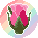

<h1 align="center">rosebud assets  </h1>

there are three folders of icons:

- `png`: contains 1:1 scale pixel art icons
- `png-hq`: contains upscaled versions of the icons
- `svg` (**preferred**)[^1]: contains svg versions of the icons

each folder contains several different icons:

- `rosebud`: the rosebud logo.
- `rosebud_square`: the rosebud logo padded to be a square.
- `rosebud_bg_square`: the rosebud logo with background, preferred for square icons.
- `rosebud_bg_circle`: the rosebud logo with background, preferred for circular icons.
- `rosebud_bg_square_old`: old square logo; should not be used.

[^1]: svg files are preferred as they scale better than pngs (no upscaling filters) and have smaller file sizes than the high quality pngs.
